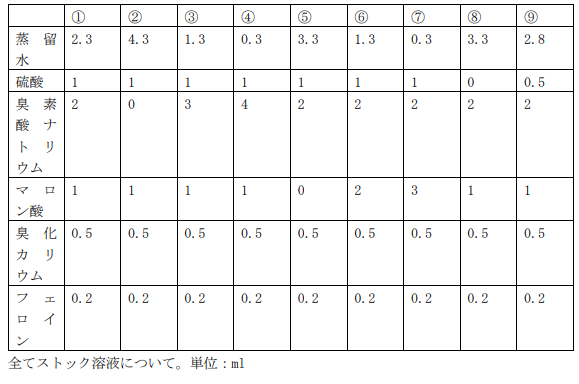
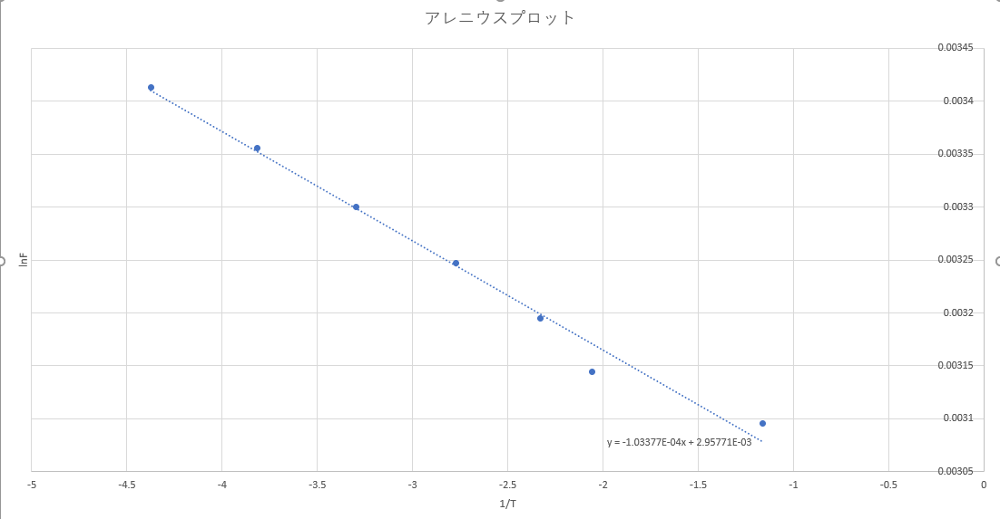

1TE19338R 喜多亮介

## 事前準備

使用した溶液は以下である。

## 実験 1 リズム反応 

リズム発現の条件確認

### 実験操作

上図のように①～⑨の溶液を調整した。

### 課題

1. ①〜⑨各条件において、リズム反応の生成の有無を確認せよ。

#### リズム反応あり

① ③ ④ ⑦ ⑨

#### リズム反応なし

② ⑤ ⑥ ⑧ 

2. リズム反応が発生する系全てについて、振動周期を測定せよ。

赤→青に変わった瞬間から計測した。※動画内時間をメモ、赤(r), 青(b)

①

0:50(b), 0:54(r), 1:09(b), 1:13(r), 1:28(b), 1:32(r), 1:46(b), 1:48(r), 2:03(b), 2:06(r)

赤→青の平均時間

(15+15+14+15)/4 = 14.8 s

青→赤の平均時間
(4+4+4+2+3)/5 = 3.4 s

③

2:54(b), 2:56(r), 2:58(b), 3:00(r), 3:03(b), 3:06(r), 3:08(b), 3:10(r), 3:13(b), 3:15(r), 3:17(b), 3:19(r), 3:22(b), 3:25(r)

赤→青の平均時間

(2+3+2+3+2+3)/6 = 2.5 s

青→赤の平均時間
(2+2+3+2+2+2+3)/7 = 2.3 s

④

赤→青の平均時間

1 s

青→赤の平均時間
1 s

⑦

1:47(b), 1:50(r), 2:04(b), 2:06(r), 2:20(b), 2:22(r), 2:34(b), 2:36(r), 2:47(b)

赤→青の平均時間

(14+14+12+11)/4 = 12.8 s

青→赤の平均時間

(3+2+2+2)/4 = 2.3 s

⑨

6:23(b), 6:43(r), 7:52(b), 8:10(r), 9:21(b)

赤→青の平均時間

(9+11)/2 = 10 s

青→赤の平均時間

(20+18)/2= 19 s

3. 各溶液の組成と振動周期の関係を整理し、各因子の働きを踏まえて組成変化が振動反応の速度論に与える効果を考察せよ。

調製溶液の組成(mmol)は以下の通りである。

#### ①と②の比較

①はリズム反応が見られたが、②は見られなかった。
その理由は明らかに臭素酸ナトリウムの有無である。

臭素酸ナトリウムは無ければ、HBrO2を生成することができないので、赤から青への反応（Fe2+からFe3+）が起きない。

#### ③と④の比較

③と④は周期が異なっている。

③の場合は2.5+2.3 = 4.8s

④の場合は1+1= 2s

このように臭素酸ナトリウムの量が振動周期に影響していることがわかる。

臭素酸が多い方が、HBrO2を多量に生成でき、反応の回転率がよくなっていると考えられる。

#### ⑥ ⑦の比較

マロン酸の量が異なっている。

⑥についてはマロン酸が少なく、マロン酸、臭化マロン酸からギ酸とCO2が発生する青から赤(Fe3+からFe2+)の反応が持続困難になっていると考えられる。

#### ⑤ ⑧について
それぞれマロン酸と硫酸がそもそも加えられていないため諸々の反応が起きずに周期は現れない。

特にマロン酸についてはBZ反応の根幹である。

## 実験 2 リズム反応の活性化エネルギー

実験 1 の溶液①について、
20℃
25℃
30℃
35℃
40℃
45℃
50℃
の 7 条件下での、振動周期を測定せよ。振動周波数に対してアレニウスプロットを行い、BZ
反応の活性化エネルギーを求めよ。

20℃ 

1. 0:26, 2:10 104s
2. 2:10, 3:30 80s
3. 3:30, 4:48 78s
4. 4:48, 6:00 72s
5. 6:00, 7:04 64s

平均 79.6s, 標準偏差 14.993 

振動周波数 0.0126 Hz

25℃

1. 0:17, 1:09 52s
2. 1:09, 1:58 49s
3. 1:58, 2:44 46s
4. 2:44, 3:25 41s
5. 3:25, 4:04 39s

平均 45.4s 標準偏差 5.413 

振動周波数 0.0220 Hz

30℃ 

1. 0:16, 0:47 31s
2. 0:47, 1:14 27s
3. 1:14, 1:41 27s
4. 1:41, 2:07 26s
5. 2:07, 2:31 24s

平均 27s 標準偏差 2.55

振動周波数 0.0370 Hz

35℃ 

1. 0:12, 0:28 16s
2. 0:28, 0:45 17s
3. 0:45, 1:01 16s
4. 1:01, 1:16 15s
5. 1:16, 1:32 16s

平均 16s 標準偏差 0.707

振動周波数 0.0625 Hz

40℃ 

1. 0:07, 0:17 10s
2. 0:17, 0:29 12s
3. 0:29, 0:39 10s
4. 0:39, 0:48 9s
5. 観測不可

平均 10.25s 標準偏差 1.258

振動周波数 0.0976 Hz

45℃ 

1. 0:10, 0:18 8s
2. 0:18, 0:26 8s
3. 0:26, 0:35 9s
4. 0:35, 0:42 7s
5. 0:42, 0:49 7s

平均 7.8s 標準偏差 0.837

振動周波数 0.128 Hz

50℃ 

1. 0:09, 0:11 2s
2. 0:11, 0:14 3s 
3. 0:14, 0:18 4s 
4. 0:18, 0:21 3s 
5. 0:21, 0:25 4s

平均 3.2s 標準偏差 0.837

振動周波数 0.313 Hz

ここで、フェロインとフェリインの平衡反応の振動周波数は反応速度に比例すると近似できるので、
温度の逆数と自然対数をとった振動周波数をプロットすると（アレニウスプロット）

傾きは`-1.03377E-04`なので、 

活性化エネルギーEは、

E = -R*(傾き)
　= -8.314*-1.03377E-04
  = 0.000859476378 = 8.6*10^-4 J/mol 

### 考察課題：

BZ 反応の活性化エネルギーの内容について、リズム反応のメカニズムを踏まえて考察せよ。

BZ反応の重要なプロセスはHBrO2の自己触媒的反応であり、

BrO3- + HBrO2 + H+ -> 2HBrO2 + 2Fe3+

ここで、HBrO2だけは自分自身が経時的に増加するため進行度が全体の反応速度に寄与していると考えると、BZ反応のリズム的な部分である振動周波数Fは、

F∝k[H+][BrO3-] とできる。

ここで活性化エネルギーをEとすると、

k = Aexp(-E/RT) となり

kの代わりに測定した振動周波数を用いてアレニウスプロットすることによりリズム反応の活性化エネルギーを求めることができる。

## 実験3 空間パターン反応

### 実験操作

### 課題１

① なし

② ターゲットパターン

③ ターゲットパターン ②より綺麗

④ ターゲットパターン ③より綺麗

⑤ 綺麗なスパイラルパターン

⑥ ターゲットパターン とてもきめ細かい

1. ターゲットパターンが最も綺麗な溶液

④溶液が最も綺麗だった。

2. スパイラルパターンが最も綺麗な溶液

⑤溶液が最も綺麗だった。

進行速度は資料より、H+の濃度に比例するので硫酸が多い溶液ほどターゲットパターンが広がる速度が速くなっていると考えられる。

これは実験動画を観察したとき、硫酸の量が多い溶液ほどターゲットパターンがきめ細かくなっていることを説明できる。

### 課題２

1. 波の伝搬速度

④溶液で計測を行った。

ドット間の距離が5mmであることを利用した。

1:31(5mm), 2:21(10mm), 4:00(15mm)

5mm/50s, 5mm/99s

よって伝搬速度は 0.15mm/s であった。

2. 定点における振動周波数

5mm での通過点を測定した。

1:37, 2:13, 2:43, 3:17, 3:54

よって、

(36+30+34+37)/4 = 34.3s 

振動周波数は 0.0292 hz であった。

### 考察課題１

・リズム反応では赤と青の色変化であったのに対し、なぜパターン反応は白っぽく見えるのか。何が白く見えているのか。考察せよ。

薄く広げ薄膜上にしたことで溶液の屈折率が代わり見える色が変わっている。

### 考察課題２

・なぜパターンの発生に銀線を用いると良いのであろうか。理由を考察せよ。

銀線を入れることによりターゲットパターンを可視化することができる。これは固形物付近の界面で時間的リズムが伝播することでターゲットパターﾝを可視化することができるため。

また銀イオンが析出することによりイオン性の溶液となりBr-がBrとして気化するのを防いでいる。

## 実験 4 光感受性パターン形成 

### 実験操作

### 課題１

ポジ像になる間隔を周期として測定した。

①

1:35, 1:46, 1:56, 2:08

よって平均をとると、

(11 + 10 + 12 )/3 = 11s

②

0:57, 1:05, 1:13, 1:21

(8 + 8 + 8)/3 = 8s

③

0:47, 0:54, 1:00, 1:06

(7 + 6 + 6)/3 = 6.3s

④

ポジ像になっているのはほのかに見えるが見えない時もあり測定は困難であった。（濃ゆすぎて見えなかった。）

⑤

④と同様に測定できなかった。（薄すぎて見えなかった。）

#### 結果

硫酸が少ないと濃ゆくなり、硫酸が多いと薄くなり像が見えなくなった。

適切な量の硫酸を使うことで①②③のように測定可能な像が見えた。

また、蒸留水が少ないほどポジ像になる周期が短くなっていった。

### 課題２

条件２において４種類のマスクパターンで測定をした。

１．全面黒面

波の発生は外側から起こっており、外側から徐々にポジ像へ移行していた。

２．中央黒円

黒色領域の境界から内側に向かって波が発生していることが分かった。

３．中央黒グラデーション

今回の場合はグラデーションが濃い内側から波が発生していたように見えた。

４．全面黒グラデーション

３と同様にグラデーションが濃い内側から外側に向かって波が発生していた。

### 課題３

黒色領域の境界部分から発生する波と外側から発生する波が衝突し、ポジ画像が出来る瞬間が存在しているように見えた。

これは光照射することによってRu触媒が光を吸収し、Br-の生成速度が変化することにより黒色領域部以外の場所では波が発生しなくなることから、波が衝突する瞬間に像ができているということになる。さらにそれがリズム反応により周期的に行われるので定期的に像が現れるようになっていると考えた。

## 実験全体を通じた考察課題

自発的にリズムやかたち・パターンが生成し、勝手に持続する現象である自己秩序形成反応と生命現象との関わりを考えるとき、その例としてすぐに思いつく器官は心臓である。

心臓と言えば定期的に動く心筋とそれが自発的に持続する拍動という機能があり、まさに自己秩序形成反応の特徴をもつ器官である。その心臓は実際に生命が有する器官であり、その仕組みはかなり複雑なためほとんど解明されていない。大まかな仕組みとしては、心臓の心筋細胞の各々が固有のリズムをもって収縮する機能を持っており、ここで細胞レベルの自己秩序形成がされており、さらにその心筋細胞がいくつか集まることにより細胞同士の収縮タイミングが揃うことで一つの大きな収縮をするようになり、またここで細胞が集まった器官レベルでの自己秩序形成がされるという複雑さを持っている。

これは心筋だけを見た秩序形成であるが、もう少し広い視点で考えてみると心筋を動かすためのエネルギー供給もパターン化され持続していることから自己秩序形成がされていると考えられる。

このように生命器官は様々なミクロな自己秩序形成がさらに組織化することでマクロな器官として形成されたもので、今回の実験のような化学反応レベルでの自己秩序形成反応を考えることで複雑な生命器官の仕組みを解明することに繋がり、また医療の発展などへの貢献に繋がるのではないかと思った。
