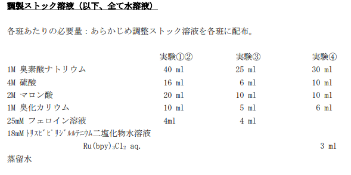
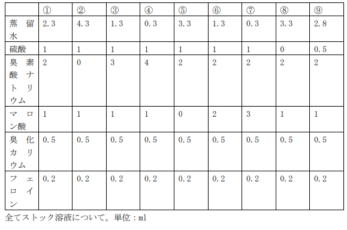
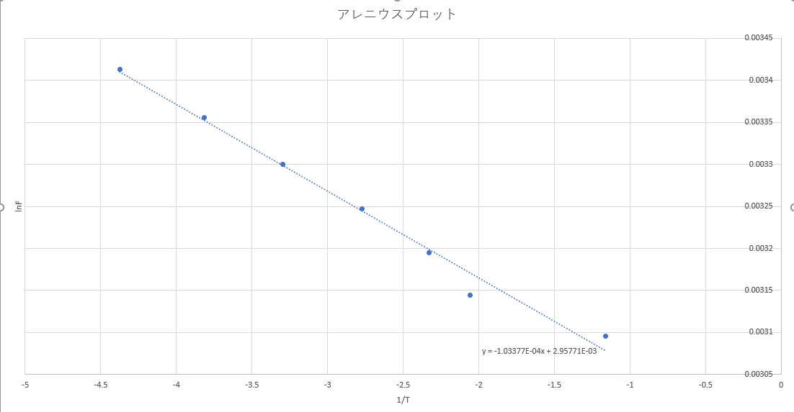

## 事前準備

使用した溶液は以下である。

## 実験 1 リズム反応 

リズム発現の条件確認

### 実験操作

上図のように①～⑨の溶液を調整した。

### 課題

1. ①〜⑨各条件において、リズム反応の生成の有無を確認せよ。

#### リズム反応あり

① ③ ④ ⑦ ⑨

#### リズム反応なし

② ⑤ ⑥ ⑧ 

2. リズム反応が発生する系全てについて、振動周期を測定せよ。

赤→青に変わった瞬間から計測した。※動画内時間をメモ、赤(r), 青(b)

①

0:50(b), 0:54(r), 1:09(b), 1:13(r), 1:28(b), 1:32(r), 1:46(b), 1:48(r), 2:03(b), 2:06(r)

赤→青の平均時間

(15+15+14+15)/4 = 14.8 s

青→赤の平均時間
(4+4+4+2+3)/5 = 3.4 s

③

2:54(b), 2:56(r), 2:58(b), 3:00(r), 3:03(b), 3:06(r), 3:08(b), 3:10(r), 3:13(b), 3:15(r), 3:17(b), 3:19(r), 3:22(b), 3:25(r)

赤→青の平均時間

(2+3+2+3+2+3)/6 = 2.5 s

青→赤の平均時間
(2+2+3+2+2+2+3)/7 = 2.3 s

④

赤→青の平均時間

1 s

青→赤の平均時間
1 s

⑦

1:47(b), 1:50(r), 2:04(b), 2:06(r), 2:20(b), 2:22(r), 2:34(b), 2:36(r), 2:47(b)

赤→青の平均時間

(14+14+12+11)/4 = 12.8 s

青→赤の平均時間

(3+2+2+2)/4 = 2.3 s

⑨

6:23(b), 6:43(r), 7:52(b), 8:10(r), 9:21(b)

赤→青の平均時間

(9+11)/2 = 10 s

青→赤の平均時間

(20+18)/2= 19 s

3. 各溶液の組成と振動周期の関係を整理し、各因子の働きを踏まえて組成変化が振動反応の速度論に与える効果を考察せよ。

## 実験 2 リズム反応の活性化エネルギー

実験 1 の溶液①について、
20℃
25℃
30℃
35℃
40℃
45℃
50℃
の 7 条件下での、振動周期を測定せよ。振動周波数に対してアレニウスプロットを行い、BZ
反応の活性化エネルギーを求めよ。

20℃ 

1. 0:26, 2:10 104s
2. 2:10, 3:30 80s
3. 3:30, 4:48 78s
4. 4:48, 6:00 72s
5. 6:00, 7:04 64s

平均 79.6s, 標準偏差 14.993 

振動周波数 0.0126 Hz

25℃

1. 0:17, 1:09 52s
2. 1:09, 1:58 49s
3. 1:58, 2:44 46s
4. 2:44, 3:25 41s
5. 3:25, 4:04 39s

平均 45.4s 標準偏差 5.413 

振動周波数 0.0220 Hz

30℃ 

1. 0:16, 0:47 31s
2. 0:47, 1:14 27s
3. 1:14, 1:41 27s
4. 1:41, 2:07 26s
5. 2:07, 2:31 24s

平均 27s 標準偏差 2.55

振動周波数 0.0370 Hz

35℃ 

1. 0:12, 0:28 16s
2. 0:28, 0:45 17s
3. 0:45, 1:01 16s
4. 1:01, 1:16 15s
5. 1:16, 1:32 16s

平均 16s 標準偏差 0.707

振動周波数 0.0625 Hz

40℃ 

1. 0:07, 0:17 10s
2. 0:17, 0:29 12s
3. 0:29, 0:39 10s
4. 0:39, 0:48 9s
5. 観測不可

平均 10.25s 標準偏差 1.258

振動周波数 0.0976 Hz

45℃ 

1. 0:10, 0:18 8s
2. 0:18, 0:26 8s
3. 0:26, 0:35 9s
4. 0:35, 0:42 7s
5. 0:42, 0:49 7s

平均 7.8s 標準偏差 0.837

振動周波数 0.128 Hz

50℃ 

1. 0:09, 0:11 2s
2. 0:11, 0:14 3s 
3. 0:14, 0:18 4s 
4. 0:18, 0:21 3s 
5. 0:21, 0:25 4s

平均 3.2s 標準偏差 0.837

振動周波数 0.313 Hz

ここで、フェロインとフェリインの平衡反応の振動周波数は反応速度に比例すると近似できるので、
温度の逆数と自然対数をとった振動周波数をプロットすると（アレニウスプロット）

傾きは`-1.03377E-04`なので、 

活性化エネルギーEは、

E = -R*(傾き)
　= -8.314*-1.03377E-04
  = 0.000859476378 = 8.6*10^-4 J/mol 

## 実験3 空間パターン反応

### 実験操作

## 実験全体を通じた考察課題

自発的にリズムやかたち・パターンが生成し、勝手に持続する現象である自己秩序形成反応と生命現象との関わりを考えるとき、その例としてすぐに思いつく器官は心臓である。

心臓と言えば定期的に動く心筋とそれが自発的に持続する拍動という機能があり、まさに自己秩序形成反応の特徴をもつ器官である。その心臓は実際に生命が有する器官であり、その仕組みはかなり複雑なためほとんど解明されていない。大まかな仕組みとしては、心臓の心筋細胞の各々が固有のリズムをもって収縮する機能を持っており、ここで細胞レベルの自己秩序形成がされており、さらにその心筋細胞がいくつか集まることにより細胞同士の収縮タイミングが揃うことで一つの大きな収縮をするようになり、またここで細胞が集まった器官レベルでの自己秩序形成がされるという複雑さを持っている。

これは心筋だけを見た秩序形成であるが、もう少し広い視点で考えてみると心筋を動かすためのエネルギー供給もパターン化され持続していることから自己秩序形成がされていると考えられる。

このように生命器官は様々なミクロな自己秩序形成がさらに組織化することでマクロな器官として形成されたもので、今回の実験のような化学反応レベルでの自己秩序形成反応を考えることで複雑な生命器官の仕組みを解明することに繋がり、また医療の発展などへの貢献に繋がるのではないかと思った。
